# AdminLTE 4 for Laravel

[](https://packagist.org/packages/colorlibhq/adminlte-laravel)
[](LICENSE)

Official [AdminLTE 4](https://adminlte.io) integration for Laravel — Bootstrap 5.3, vanilla JS (no jQuery), Vite-ready.

<!-- TODO: confirm the final preview URL once the Laravel app is live on the SSH preview server (adminlte.io/themes/laravel). See docs/deployment.md. -->
<p align="center">
  <a href="https://adminlte.io/themes/laravel/">
    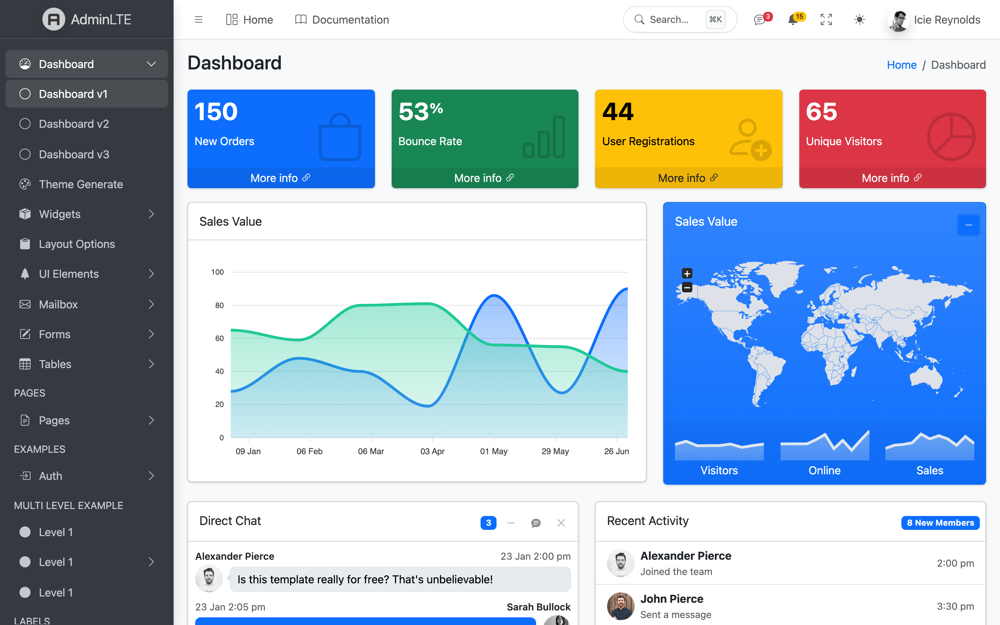
  </a>
  <a href="https://adminlte.io/themes/laravel/">
    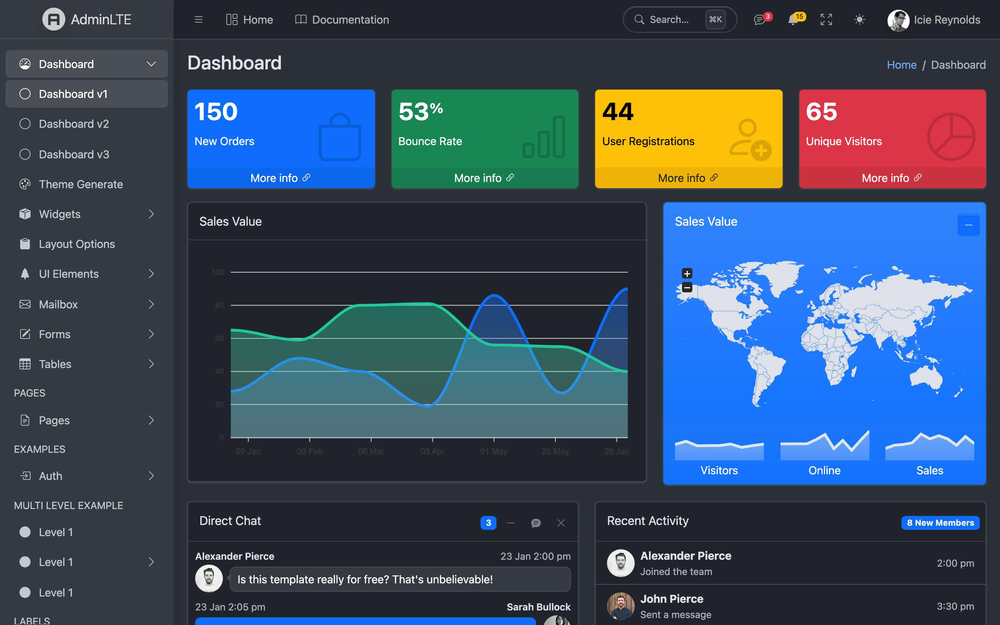
  </a>
</p>

<p align="center">
  <a href="https://adminlte.io/themes/laravel/"><strong>🔗 Live demo →</strong></a>
  &nbsp;·&nbsp;
  <a href="docs/installation.md"><strong>Get started →</strong></a>
</p>

This package gives you a config-driven sidebar menu, ready-to-extend Blade layouts, and a set of AdminLTE Blade components on top of the [`admin-lte`](https://www.npmjs.com/package/admin-lte) npm package.

**What's included:**

- **40 Blade components** (cards, widgets, forms, charts, calendars, kanban boards, modals)
  - Widget components: Card, Small Box, Info Box, Alert, Callout, Progress, Timeline, Ratings, Direct Chat, Toast, Tabs, Accordion, Breadcrumb, and more
  - Form components: Input, Select, Textarea, Switches, Color pickers, Flatpickr, Tom Select
  - Tool components: Modals, Datatables, Rich editor, **Charts (ApexCharts)**, **Vector Map**, **Calendar**, **Kanban**, **Wizard**
- **Multi-language support** (i18n) with 9 locales: English, German, Spanish, French, Italian, Portuguese, Russian, Chinese, Japanese
- **Plugin system** for lazy-loading JS libraries (Flatpickr, Tom Select, Tabulator, Quill, **ApexCharts**, **jsVectorMap**, **FullCalendar**, **SortableJS**)
- **Scaffolding system** (`adminlte:scaffold`) with full DB backing for 11 sections: mailbox, chat, kanban, calendar, projects, file-manager, profile, settings, invoice, pricing, faq
- **Auth scaffolding** (`adminlte:make-auth`) for plain/Breeze/Fortify integration
- **⌘K command palette** — searches your menu, opens via the navbar pill or Cmd/Ctrl+K
- **Bundled demo/showcase pages** — Dashboard v1/v2/v3, Widgets, UI Elements, Forms, Tables, Layout Options, Theme Generator (toggle with `config('adminlte.demo')`)
- RTL layout support + 9 locales
- Config-driven sidebar menu with permissions, active states, badges
- Auth views (login, register, login-v2, register-v2, lockscreen, forgot password, reset password)
- Error pages (404, 500, maintenance)
- Vite-first asset pipeline

## Screenshots

Every screenshot is a real page from the running Laravel app — [browse the live demo →](https://adminlte.io/themes/laravel/)

<p align="center">
  <a href="https://adminlte.io/themes/laravel/">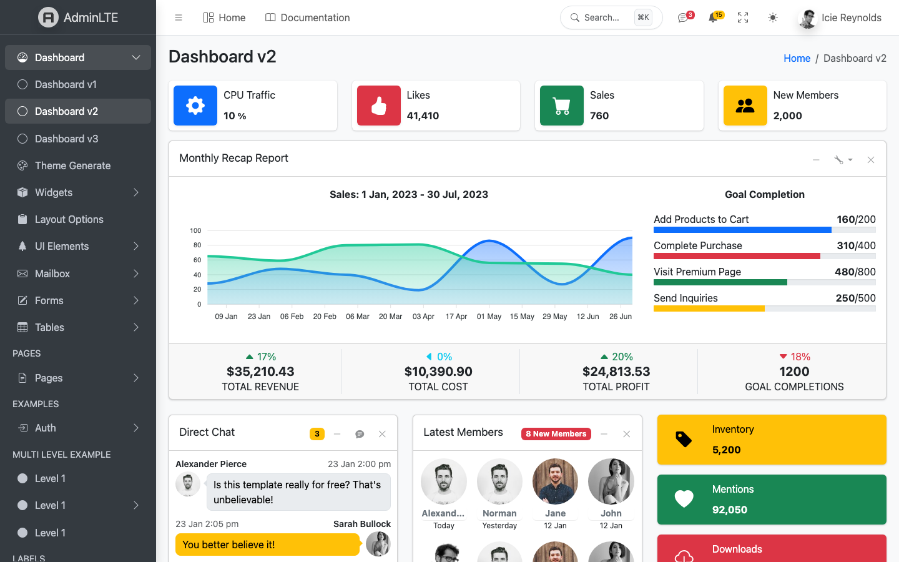</a>
  <a href="https://adminlte.io/themes/laravel/">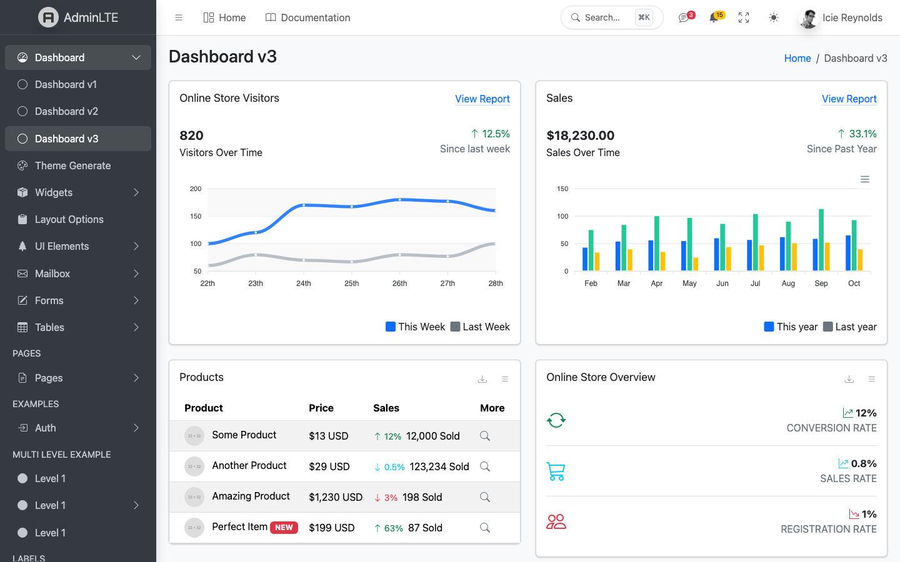</a>
  <a href="https://adminlte.io/themes/laravel/">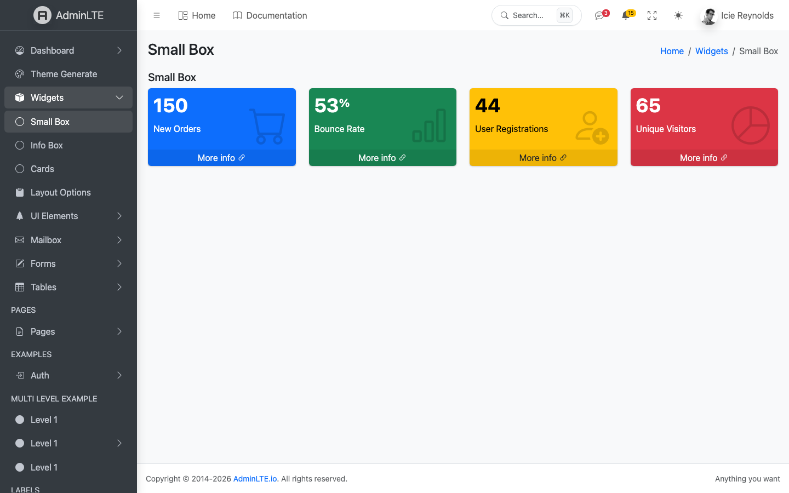</a>
</p>
<p align="center">
  <a href="https://adminlte.io/themes/laravel/">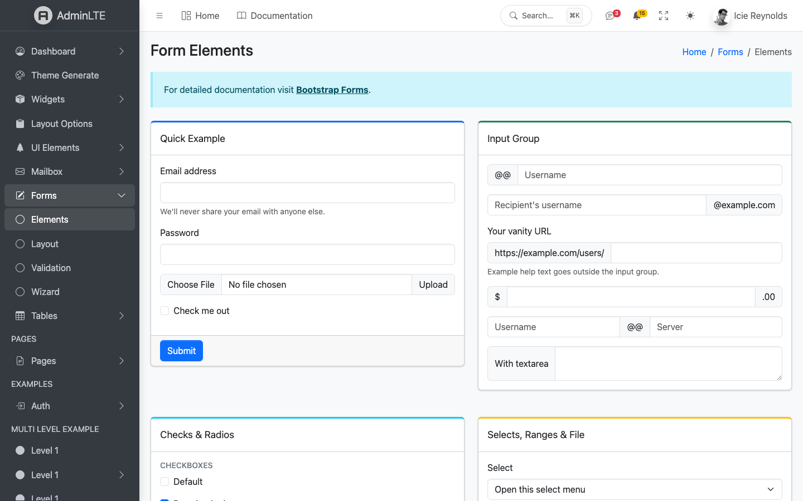</a>
  <a href="https://adminlte.io/themes/laravel/">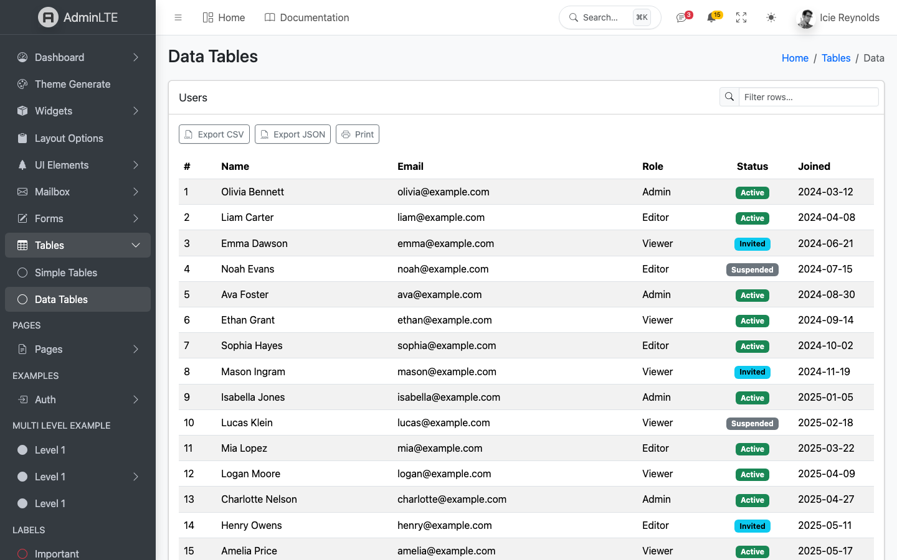</a>
  <a href="https://adminlte.io/themes/laravel/">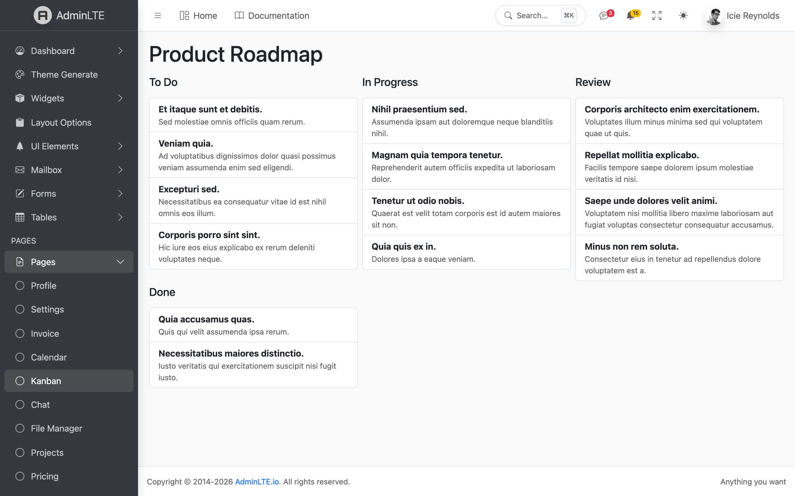</a>
</p>
<p align="center">
  <a href="https://adminlte.io/themes/laravel/">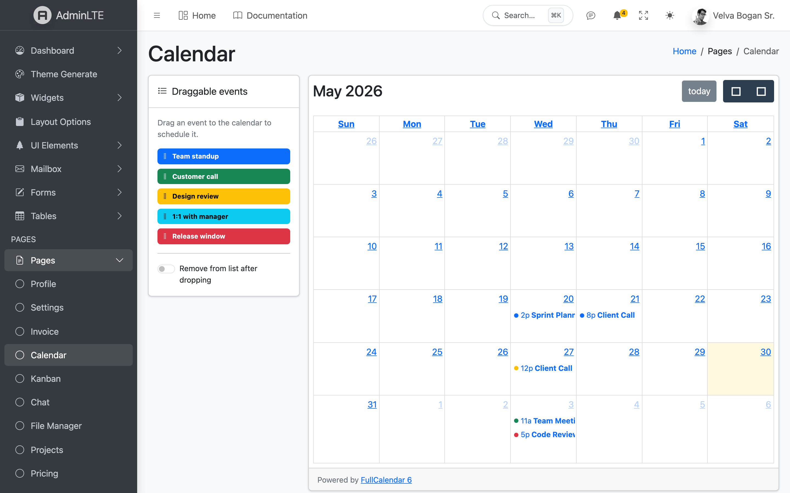</a>
  <a href="https://adminlte.io/themes/laravel/">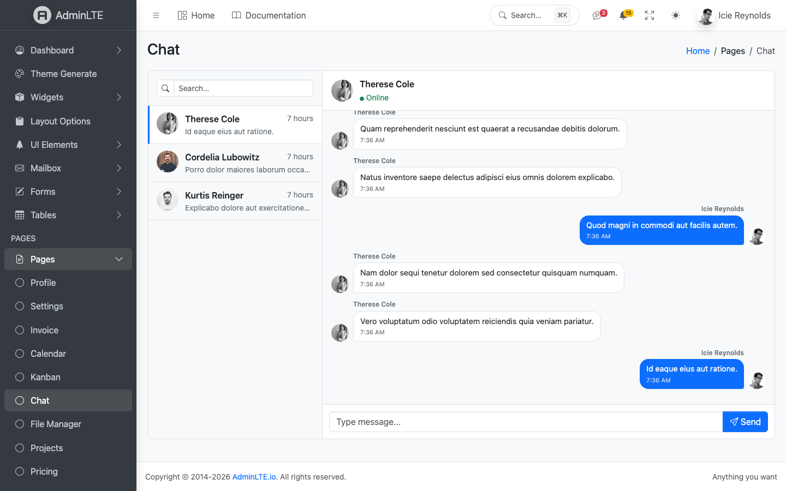</a>
  <a href="https://adminlte.io/themes/laravel/">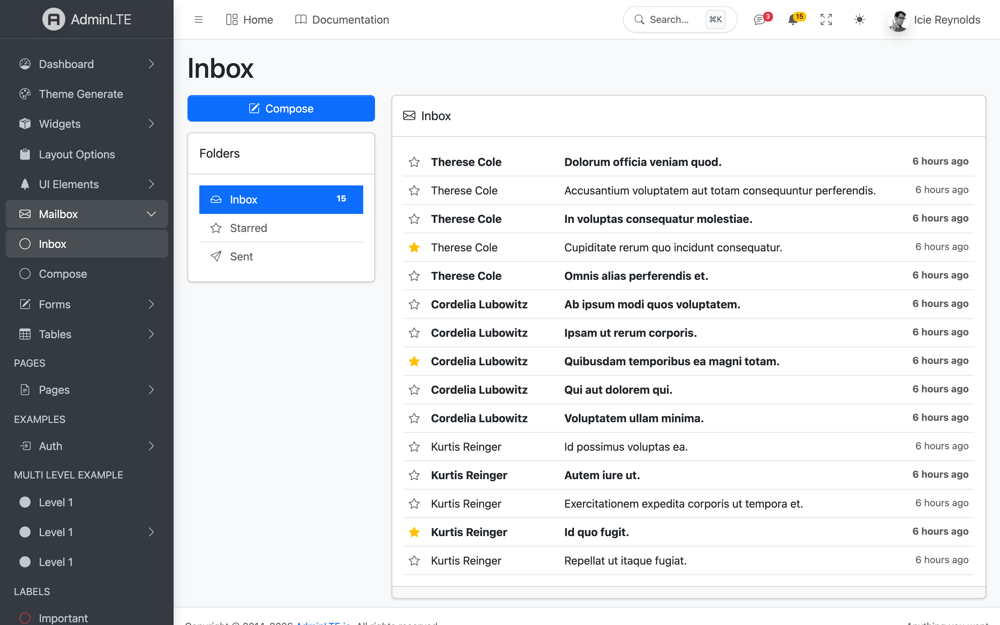</a>
</p>
<p align="center">
  <a href="https://adminlte.io/themes/laravel/">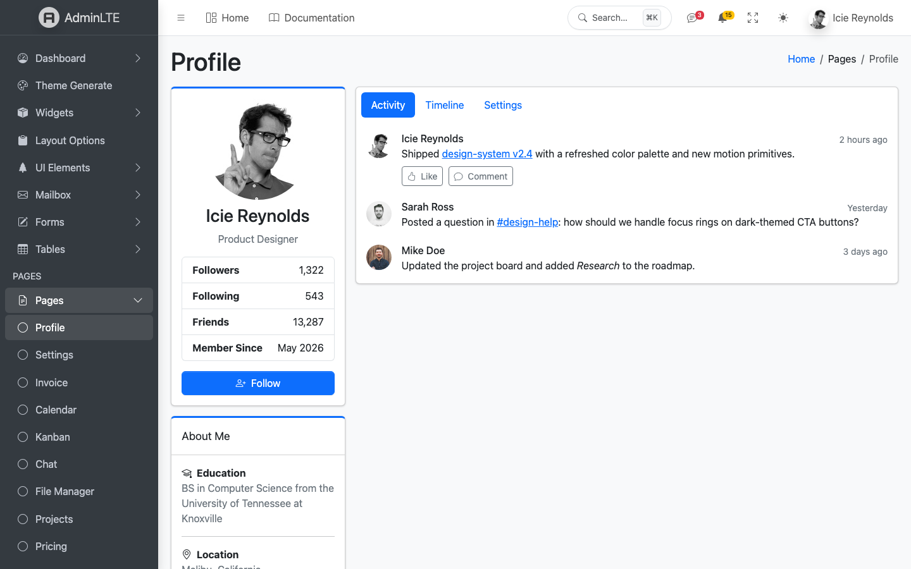</a>
  <a href="https://adminlte.io/themes/laravel/">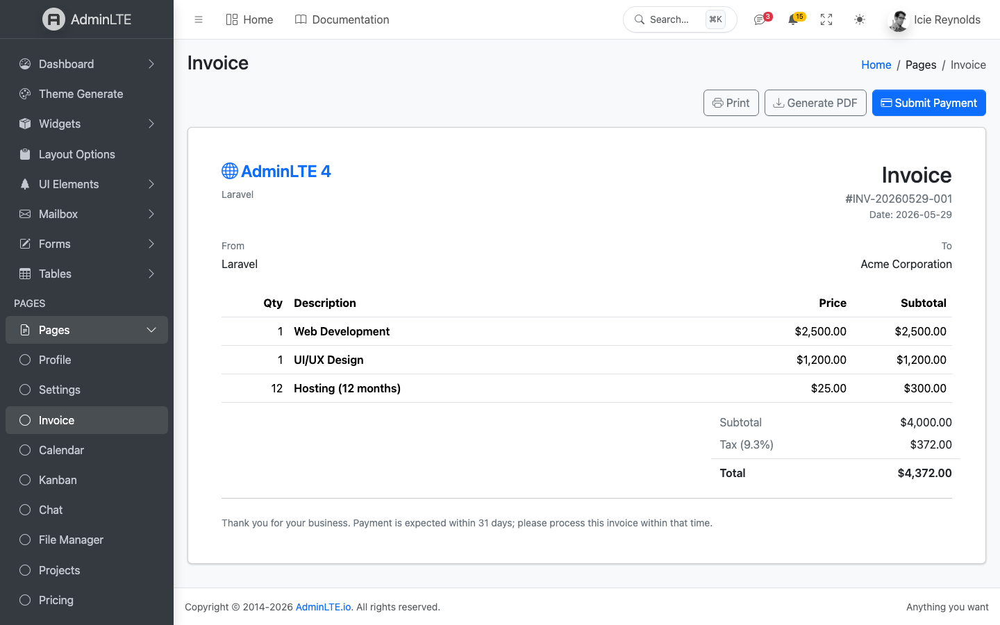</a>
  <a href="https://adminlte.io/themes/laravel/">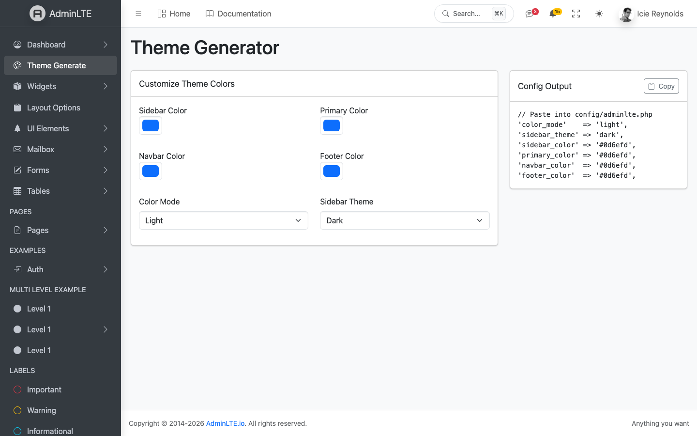</a>
</p>

## Documentation

Full docs live in the [`docs/`](docs/) directory — and are also served **inside
your app at `/docs`** (rendered with the AdminLTE layout; disable with
`'docs' => false`):

| Guide | What it covers |
|---|---|
| [Installation](docs/installation.md) | Requirements, install, Vite wiring, first page |
| [Configuration](docs/configuration.md) | Every `config/adminlte.php` key |
| [Layout](docs/layout.md) | `adminlte::page`, navbar, sidebar, footer, ⌘K search, color mode, RTL |
| [Menu](docs/menu.md) | Sidebar/navbar menu, treeview, badges, permissions, filters |
| [Components](docs/components.md) | All 40 Blade components — props, slots, examples |
| [Plugins](docs/plugins.md) | Lazy-loaded JS libraries and the plugin manager |
| [Scaffolding](docs/scaffolding.md) | `adminlte:scaffold` — DB-backed application sections |
| [Authentication](docs/authentication.md) | `adminlte:make-auth` — plain / Breeze / Fortify |
| [Commands](docs/commands.md) | All Artisan commands and options |
| [Translations](docs/translations.md) | The 9 locales and key resolution |
| [Demo pages](docs/demo-pages.md) | The bundled showcase routes |

> The legacy [`jeroennoten/laravel-adminlte`](https://github.com/jeroennoten/Laravel-AdminLTE) targets AdminLTE 3 (Bootstrap 4 + jQuery). This package is the AdminLTE 4 successor: Bootstrap 5.3, vanilla JS, Laravel 13, PHP 8.3+, Vite instead of precompiled assets.

## Requirements

- PHP 8.3+
- Laravel 13
- Node.js 18+ (for the Vite asset pipeline)

## Installation

```bash
composer require colorlibhq/adminlte-laravel
php artisan adminlte:install
```

`adminlte:install` publishes `config/adminlte.php`, drops the Vite entry stubs into `resources/js/adminlte.js` and `resources/css/adminlte.css`, and offers to `npm install` the frontend dependencies (`admin-lte`, `bootstrap`, `@popperjs/core`, `overlayscrollbars`, `bootstrap-icons`, `sass`).

Add the two entry files to your `vite.config.js`:

```js
laravel({
    input: [
        'resources/css/adminlte.css',
        'resources/js/adminlte.js',
    ],
    refresh: true,
}),
```

Then build:

```bash
npm run dev   # or: npm run build
```

Check your install at any time:

```bash
php artisan adminlte:status
```

## Usage

### A page

```blade
@extends('adminlte::page')

@section('title', 'Dashboard')

@section('content_header')
    <div class="row">
        <div class="col-sm-6"><h3 class="mb-0">Dashboard</h3></div>
    </div>
@stop

@section('content')
    <div class="row g-3">
        <div class="col-lg-3 col-6">
            <x-adminlte-small-box title="150" text="New Orders" icon="bi bi-cart" theme="primary" url="#" />
        </div>
        <div class="col-lg-3 col-6">
            <x-adminlte-info-box title="44" text="Registrations" icon="bi bi-person-plus" theme="success" />
        </div>
    </div>

    <x-adminlte-card title="Quick form" icon="bi bi-pencil" theme="primary" outline collapsible>
        <x-adminlte-input name="email" label="Email" type="email" placeholder="you@example.com" />
        <x-adminlte-button type="submit" theme="primary" icon="bi bi-check-lg" label="Save" />
    </x-adminlte-card>
@stop
```

### The menu

Define your sidebar in `config/adminlte.php` under `menu`:

```php
'menu' => [
    ['header' => 'MAIN'],
    ['text' => 'Dashboard', 'route' => 'dashboard', 'icon' => 'bi bi-speedometer'],
    ['text' => 'Users', 'url' => 'users', 'icon' => 'bi bi-people', 'can' => 'view-users', 'label' => 5, 'label_color' => 'danger'],
    ['header' => 'CONTENT'],
    [
        'text' => 'Posts',
        'icon' => 'bi bi-file-post',
        'submenu' => [
            ['text' => 'All posts', 'url' => 'posts'],
            ['text' => 'New post', 'url' => 'posts/create'],
        ],
    ],
],
```

Supported keys: `header`, `text`, `route`, `url`, `icon`, `icon_color`, `label`, `label_color`, `active` (url patterns), `target`, `can` (gate), `submenu`. Active state and authorization are resolved automatically by the menu filters.

## Components

### Widget Components
| Component | Tag | Notes |
|---|---|---|
| Card | `<x-adminlte-card>` | Collapsible, removable, with icon & theme |
| Small Box | `<x-adminlte-small-box>` | Stat box with icon & URL |
| Info Box | `<x-adminlte-info-box>` | Info box with progress bar |
| Alert | `<x-adminlte-alert>` | Dismissible alerts (info, success, warning, danger) |
| Callout | `<x-adminlte-callout>` | Highlight box with icon & theme |
| Progress | `<x-adminlte-progress>` | Progress bar with label & percentage |
| Timeline | `<x-adminlte-timeline>` | Event timeline |
| Progress Group | `<x-adminlte-progress-group>` | Group of progress bars |
| Description Block | `<x-adminlte-description-block>` | Description with title & icon |
| Profile Card | `<x-adminlte-profile-card>` | User profile card with stats |
| Ratings | `<x-adminlte-ratings>` | Star rating display |
| Direct Chat | `<x-adminlte-direct-chat>` | Chat widget with flip-pane |
| Toast | `<x-adminlte-toast>` | Bootstrap 5 toast notification |
| Tabs | `<x-adminlte-tabs>` | Tab navigation wrapper |
| Tab | `<x-adminlte-tab>` | Individual tab pane |
| Accordion | `<x-adminlte-accordion>` | Accordion wrapper |
| Accordion Item | `<x-adminlte-accordion-item>` | Accordion panel |
| Breadcrumb | `<x-adminlte-breadcrumb>` | Bootstrap breadcrumb navigation |

### Form Components
| Component | Tag | Notes |
|---|---|---|
| Input | `<x-adminlte-input>` | Text input with validation |
| Input (Flatpickr) | `<x-adminlte-input-flatpickr>` | Date/time picker |
| Input (Tom Select) | `<x-adminlte-input-tom-select>` | Searchable select dropdown |
| Input (Switch) | `<x-adminlte-input-switch>` | Toggle switch |
| Input (Color) | `<x-adminlte-input-color>` | Color picker |
| Input (File) | `<x-adminlte-input-file>` | File upload |
| Textarea | `<x-adminlte-textarea>` | Multi-line text input |
| Select | `<x-adminlte-select>` | Native select dropdown |
| Button | `<x-adminlte-button>` | Themed button (primary, success, danger, etc.) |

### Tool Components
| Component | Tag | Notes |
|---|---|---|
| Chart | `<x-adminlte-chart>` | ApexCharts (area, line, bar, donut, pie, sparkline) |
| Vector Map | `<x-adminlte-vector-map>` | jsVectorMap world/region maps |
| Calendar | `<x-adminlte-calendar>` | FullCalendar 6 event calendar |
| Kanban | `<x-adminlte-kanban>` | SortableJS drag-to-reorder board |
| Sortable | `<x-adminlte-sortable>` | Generic SortableJS wrapper |
| Wizard | `<x-adminlte-wizard>` | Multi-step form wizard |
| Wizard Step | `<x-adminlte-wizard-step>` | Individual wizard step |
| Modal | `<x-adminlte-modal>` | Bootstrap 5 modal dialog |
| Datatable | `<x-adminlte-datatable>` | Tabulator data table |
| Editor | `<x-adminlte-editor>` | Quill rich text editor |

### Navbar Components
| Component | Tag |
|---|---|
| Notifications Dropdown | `<x-adminlte-nav-notifications>` |
| Messages Dropdown | `<x-adminlte-nav-messages>` |
| Tasks Dropdown | `<x-adminlte-nav-tasks>` |

Form components auto-display validation errors from the session and repopulate with `old()` input. Chart, map, and calendar components auto-enable their plugins.

## Scaffolding

Generate complete, working application sections — migrations, models,
controllers, seeders, routes, and data-driven views — with one command:

```bash
php artisan adminlte:scaffold              # interactive multi-select
php artisan adminlte:scaffold mailbox      # a single section
php artisan adminlte:scaffold --all --seed # everything, with demo data
```

| Section | What you get |
|---|---|
| `mailbox` | `adminlte_messages` table, `Message` model, inbox/read/compose, seeder |
| `chat` | conversations + pivot + messages, `ChatController`, threaded UI |
| `kanban` | boards/lanes/cards (+ assignees), SortableJS board, reorder endpoint |
| `calendar` | `adminlte_events` table, FullCalendar UI + JSON feed (CRUD) |
| `projects` | `adminlte_projects` table, status/progress, CRUD index |
| `file-manager` | Laravel Storage browser (upload/delete) — no migration |
| `profile` / `settings` | auth-user pages wired to the User model |
| `invoice` / `pricing` / `faq` | ready-to-edit static pages |

Routes are added to an idempotent, auth-protected `/admin` group named
`adminlte.*`. Run `php artisan migrate` and visit `/admin/{section}`.

### Authentication

```bash
php artisan adminlte:make-auth                 # plain (default)
php artisan adminlte:make-auth --type=breeze   # Breeze integration guidance
php artisan adminlte:make-auth --type=fortify  # Fortify integration guidance
```

`plain` publishes Login / Register / ForgotPassword / ResetPassword
controllers and registers the matching routes, all wired to the package's
`adminlte::auth.*` views.

## Customization

Everything in `config/adminlte.php` is documented inline — title, logo, layout switches (`layout_fixed_sidebar`, `fixed_navbar`, `sidebar_mini`, …), the color-mode toggle, sidebar theme, and custom element classes.

For deeper visual changes (sidebar width, breakpoints, brand colors), compile AdminLTE's SCSS — see [the customization guide](https://adminlte.io/themes/v4/docs/customization.html) and Option B in `resources/css/adminlte.css`.

## Upgrade to a Premium Dashboard

Need advanced features, dedicated support, and production-ready code? Explore our handpicked collection of professional admin templates on [DashboardPack](https://dashboardpack.com/?utm_source=github&utm_medium=readme&utm_campaign=adminlte-laravel).

<table>
  <tr>
    <td align="center" width="50%">
      <a href="https://dashboardpack.com/theme-details/apex-dashboard-nextjs/?utm_source=github&utm_medium=readme&utm_campaign=adminlte-laravel">
        
      </a>
      <br>
      <a href="https://dashboardpack.com/theme-details/apex-dashboard-nextjs/?utm_source=github&utm_medium=readme&utm_campaign=adminlte-laravel"><strong>Apex Dashboard</strong></a>
      <br>
      <sub>Next.js 16 + React 19 + Tailwind CSS v4 + shadcn/ui. 5 dashboard variants, 20+ app pages, 125+ routes, full CRUD.</sub>
    </td>
    <td align="center" width="50%">
      <a href="https://dashboardpack.com/theme-details/zenith-shadcn/?utm_source=github&utm_medium=readme&utm_campaign=adminlte-laravel">
        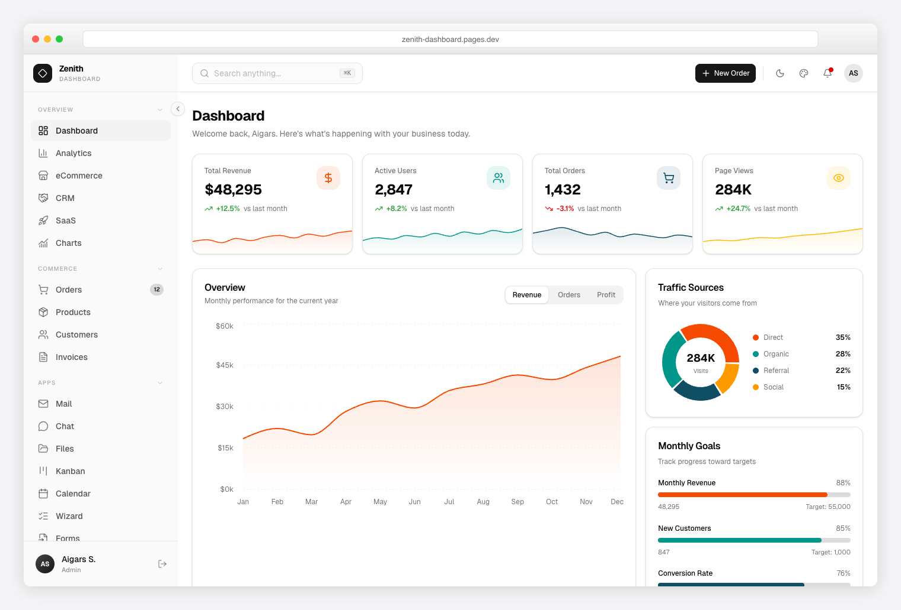
      </a>
      <br>
      <a href="https://dashboardpack.com/theme-details/zenith-shadcn/?utm_source=github&utm_medium=readme&utm_campaign=adminlte-laravel"><strong>Zenith Dashboard</strong></a>
      <br>
      <sub>Next.js 16 + React 19 + Tailwind CSS v4 + shadcn/ui. Achromatic design, 50+ pages, 6 dashboards, live theme customizer.</sub>
    </td>
  </tr>
  <tr>
    <td align="center" width="50%">
      <a href="https://dashboardpack.com/theme-details/haze-dashboard-nuxt/?utm_source=github&utm_medium=readme&utm_campaign=adminlte-laravel">
        
      </a>
      <br>
      <a href="https://dashboardpack.com/theme-details/haze-dashboard-nuxt/?utm_source=github&utm_medium=readme&utm_campaign=adminlte-laravel"><strong>Haze</strong></a>
      <br>
      <sub>Nuxt 4 + Nuxt UI v4 + Tailwind CSS v4. 92+ pages, 7 layouts, 5 dashboards, RTL, i18n, mock API layer.</sub>
    </td>
    <td align="center" width="50%">
      <a href="https://dashboardpack.com/theme-details/tailpanel/?utm_source=github&utm_medium=readme&utm_campaign=adminlte-laravel">
        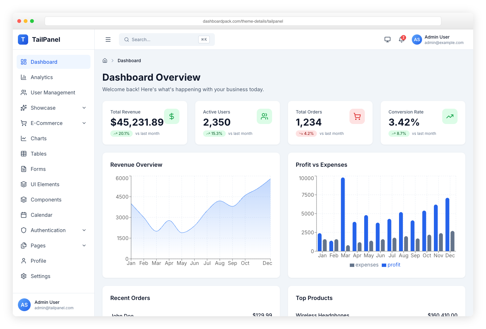
      </a>
      <br>
      <a href="https://dashboardpack.com/theme-details/tailpanel/?utm_source=github&utm_medium=readme&utm_campaign=adminlte-laravel"><strong>TailPanel</strong></a>
      <br>
      <sub>React + TypeScript + Tailwind CSS + Vite. 9 dashboard designs, dark and light themes.</sub>
    </td>
  </tr>
  <tr>
    <td align="center" width="50%">
      <a href="https://dashboardpack.com/theme-details/admindek-html/?utm_source=github&utm_medium=readme&utm_campaign=adminlte-laravel">
        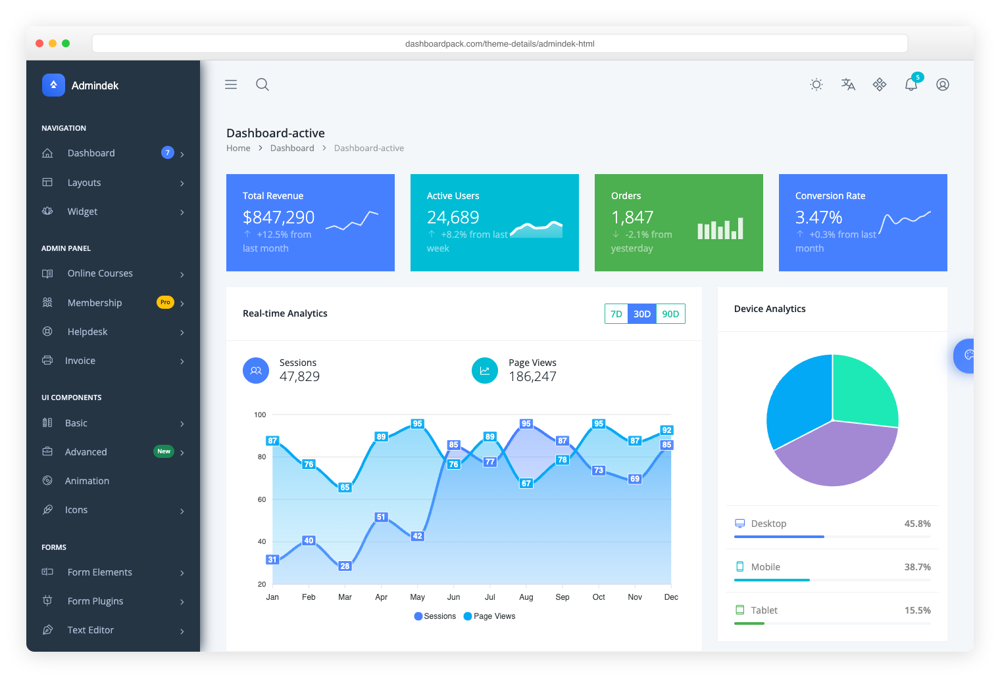
      </a>
      <br>
      <a href="https://dashboardpack.com/theme-details/admindek-html/?utm_source=github&utm_medium=readme&utm_campaign=adminlte-laravel"><strong>Admindek</strong></a>
      <br>
      <sub>Bootstrap 5 + vanilla JS. 100+ components, dark/light modes, RTL support, 10 color presets.</sub>
    </td>
    <td align="center" width="50%">
      <a href="https://dashboardpack.com/theme-details/svelteforge-premium/?utm_source=github&utm_medium=readme&utm_campaign=adminlte-laravel">
        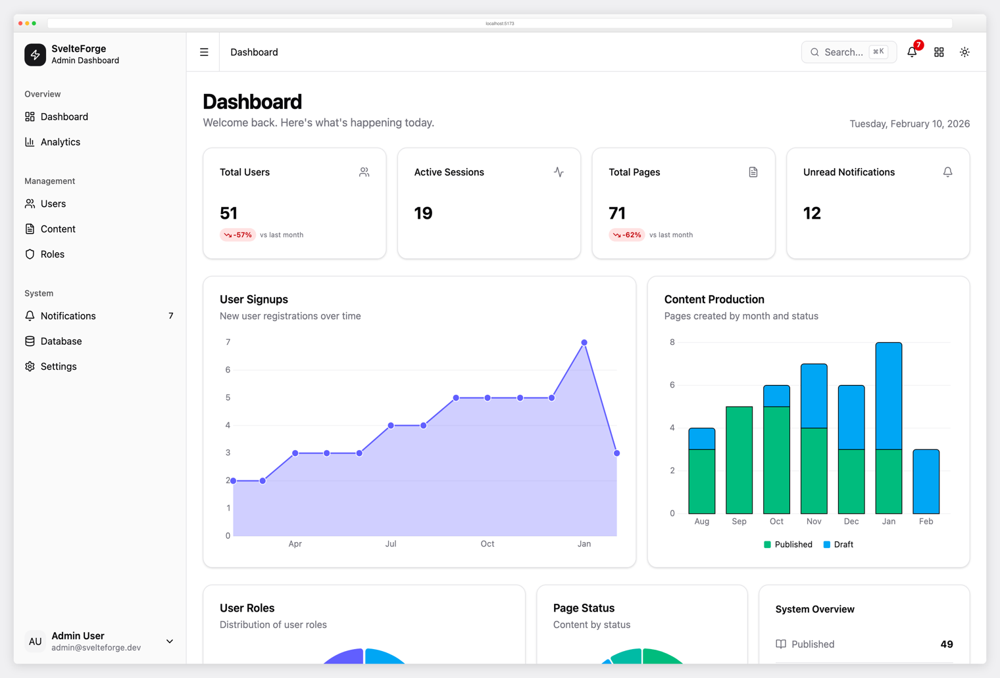
      </a>
      <br>
      <a href="https://dashboardpack.com/theme-details/svelteforge-premium/?utm_source=github&utm_medium=readme&utm_campaign=adminlte-laravel"><strong>SvelteForge Premium</strong></a>
      <br>
      <sub>SvelteKit + Tailwind CSS v4. 30+ wired-up modules, multi-tenant from row zero, dark/light/system mode.</sub>
    </td>
  </tr>
</table>

<p align="center">
  <a href="https://dashboardpack.com/?utm_source=github&utm_medium=readme&utm_campaign=adminlte-laravel"><strong>View All Premium Templates →</strong></a>
</p>

## Contributing

Issues and PRs welcome. The quality gates (Pint, Larastan level 8, PHPUnit) run
in CI on PHP 8.3 / 8.4 with Laravel 13 — see
[docs/contributing.md](docs/contributing.md) for local setup and conventions.

## Changelog

See [CHANGELOG.md](CHANGELOG.md) for the release history.

## License

MIT © [Colorlib](https://colorlib.com). See [LICENSE](LICENSE).
