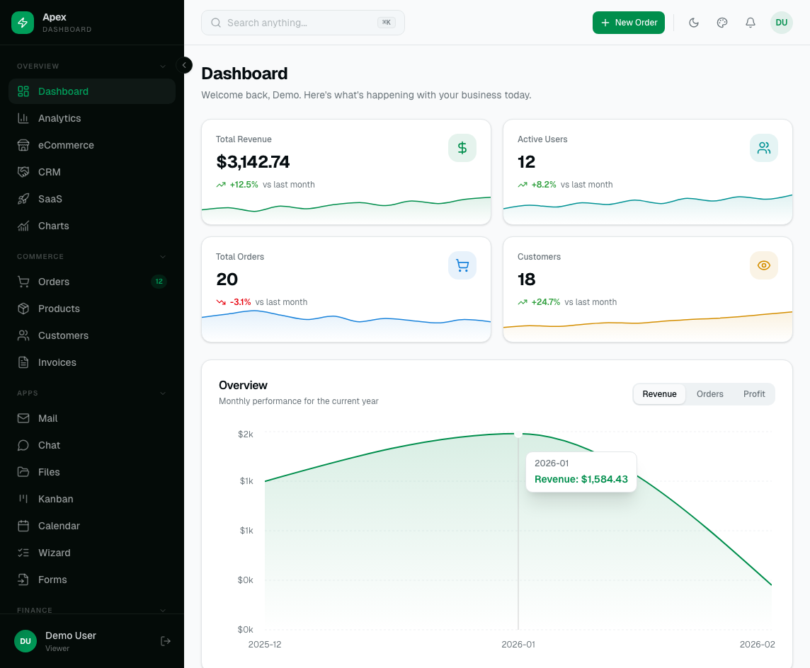
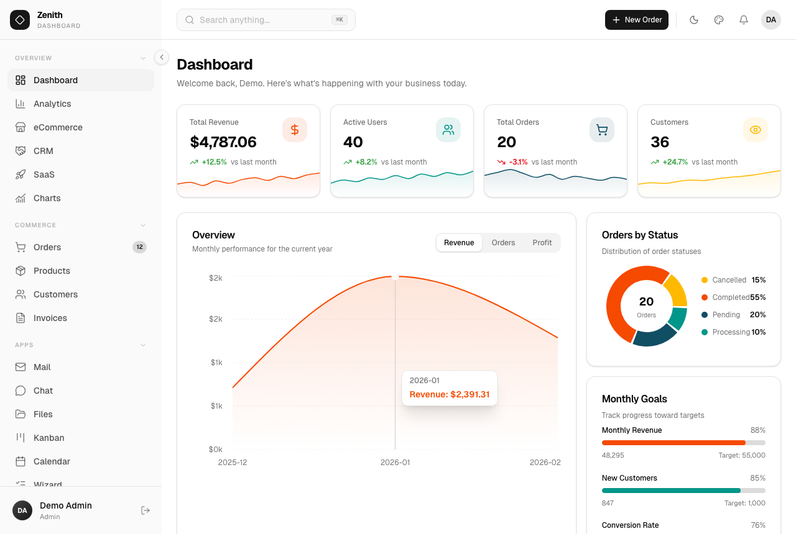
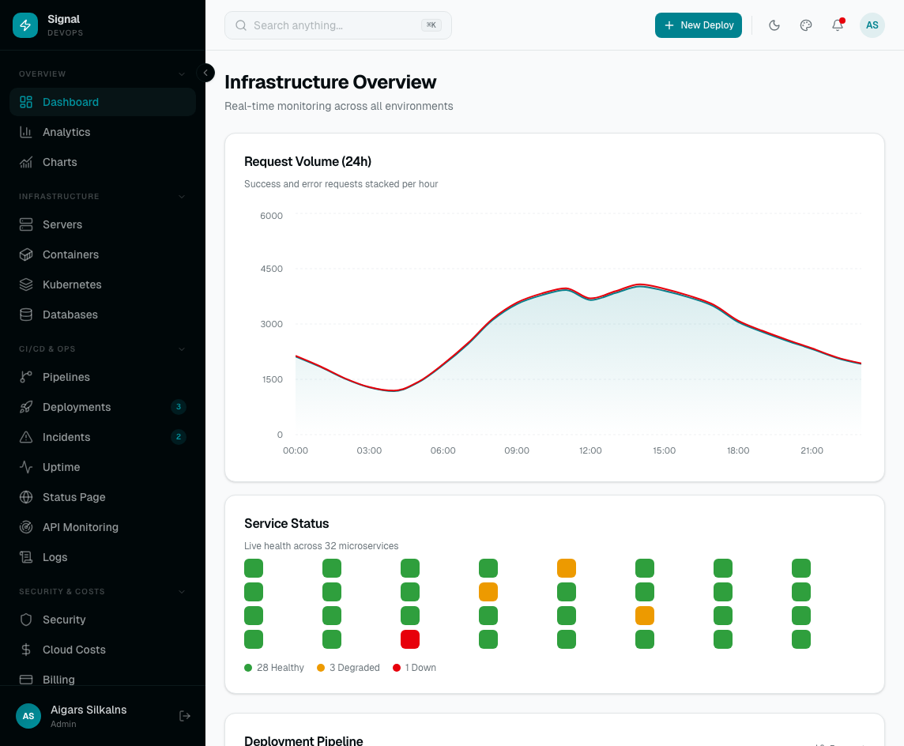
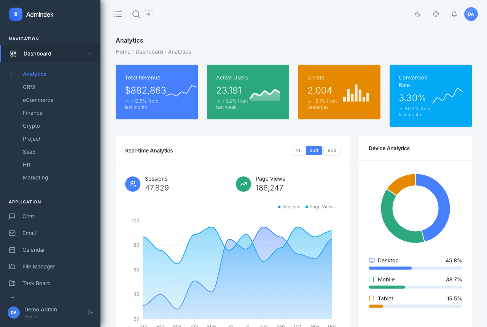

# AdminLTE 4 for Laravel

[](https://packagist.org/packages/colorlibhq/adminlte-laravel)
[](LICENSE)

Official [AdminLTE 4](https://adminlte.io) integration for Laravel — Bootstrap 5.3, vanilla JS (no jQuery), Vite-ready.

<!-- Live preview: laravel.adminlte.io (hosted on the SSH preview server). See docs/deployment.md. -->
<p align="center">
  <a href="https://laravel.adminlte.io/">
    
  </a>
  <a href="https://laravel.adminlte.io/">
    
  </a>
</p>

<p align="center">
  <a href="https://laravel.adminlte.io/"><strong>🔗 Live demo →</strong></a>
  &nbsp;·&nbsp;
  <a href="docs/installation.md"><strong>Get started →</strong></a>
</p>

This package gives you a config-driven sidebar menu, ready-to-extend Blade layouts, and a set of AdminLTE Blade components on top of the [`admin-lte`](https://www.npmjs.com/package/admin-lte) npm package.

## Also available for your stack

The same AdminLTE 4 dashboard, in the framework you know best — you're looking at the **Laravel** edition:

<p align="center">
  <a href="https://github.com/ColorlibHQ/adminlte-react"></a>
  <a href="https://github.com/ColorlibHQ/adminlte-react"></a>
  <a href="https://github.com/ColorlibHQ/adminlte-vue"></a>
  <a href="https://github.com/ColorlibHQ/adminlte-vue"></a>
  <a href="https://github.com/ColorlibHQ/adminlte-laravel"></a>
  <a href="https://github.com/ColorlibHQ/adminlte-django"></a>
</p>

<p align="center"><sub>
  Frameworks:
  <a href="https://github.com/ColorlibHQ/adminlte-react">React</a> ·
  <a href="https://github.com/ColorlibHQ/adminlte-react">Next.js</a> ·
  <a href="https://github.com/ColorlibHQ/adminlte-vue">Vue</a> ·
  <a href="https://github.com/ColorlibHQ/adminlte-vue">Nuxt</a> ·
  <strong>Laravel</strong> (you are here) ·
  <a href="https://github.com/ColorlibHQ/adminlte-django">Django</a>
</sub></p>

> Also available as the original [AdminLTE](https://github.com/ColorlibHQ/AdminLTE) (HTML · Bootstrap 5.3 · vanilla JS — [demo](https://adminlte.io/themes/v4/)) and the legacy [AdminLTE v3](https://github.com/ColorlibHQ/AdminLTE/tree/v3) (Bootstrap 4 · jQuery — [demo](https://adminlte.io/themes/v3/)). Need a full backend, not just markup? See the [premium Laravel dashboards](#premium-laravel-dashboards) below.

**What's included:**

- **40 Blade components** (cards, widgets, forms, charts, calendars, kanban boards, modals)
  - Widget components: Card, Small Box, Info Box, Alert, Callout, Progress, Timeline, Ratings, Direct Chat, Toast, Tabs, Accordion, Breadcrumb, and more
  - Form components: Input, Select, Textarea, Switches, Color pickers, Flatpickr, Tom Select
  - Tool components: Modals, Datatables, Rich editor, **Charts (ApexCharts)**, **Vector Map**, **Calendar**, **Kanban**, **Wizard**
- **Multi-language support** (i18n) with 9 **complete** locales: English, German, Spanish, French, Italian, Portuguese, Russian, Chinese, Japanese — every key translated in every locale, no English fallbacks
- **Plugin system** for lazy-loading JS libraries (Flatpickr, Tom Select, Tabulator, Quill, **ApexCharts**, **jsVectorMap**, **FullCalendar**, **SortableJS**)
- **Scaffolding system** (`adminlte:scaffold`) with full DB backing for 18 sections: dashboard, mailbox, chat, kanban, calendar, projects, file-manager, profile, settings, invoice, pricing, faq, notifications, api, impersonation, activity-log, realtime, rbac — each DB-backed section also generates **factories, Form Requests, Policies, and feature tests**
- **Authorization (RBAC)** — dependency-free roles & permissions, `HasRoles` trait, `role`/`permission` middleware, permission-aware Gate, and a Users/Roles management UI ([docs](docs/authorization.md))
- **Auth scaffolding** (`adminlte:make-auth`) for plain/Breeze/Fortify integration, with **hardening**: login throttling, email verification, password confirmation
- **Account management** — avatar, change password, active sessions, delete account ([docs](docs/account-management.md))
- **Database notifications** wired into the navbar bell + a notifications page ([docs](docs/notifications.md))
- **Activity/audit log** with automatic auth-event logging + **user impersonation** ("log in as") ([docs](docs/activity-log.md))
- **Data-driven dashboard**, **Sanctum API tokens**, and a **real-time (Reverb/Echo)** layer for live chat & notifications
- **⌘K command palette** — searches your menu, opens via the navbar pill or Cmd/Ctrl+K
- **Bundled demo/showcase pages** — Dashboard v1/v2/v3, Widgets, UI Elements, Forms, Tables, Layout Options, Theme Generator (toggle with `config('adminlte.demo')`)
- RTL layout support + 9 locales
- **Accessibility built in** — ARIA-labelled controls, screen-reader-tracked submenu state, error messages linked to their form fields, an accessible command palette (combobox/listbox)
- Config-driven sidebar menu with permissions, active states, badges — plus runtime additions via `addAfter()`/`add()`
- Auth views (login, register, login-v2, register-v2, lockscreen, forgot password, reset password)
- Error pages (404, 500, maintenance)
- Vite-first asset pipeline

## Screenshots

Every screenshot is a real page from the running Laravel app — [browse the live demo →](https://laravel.adminlte.io/)

<p align="center">
  <a href="https://laravel.adminlte.io/"></a>
  <a href="https://laravel.adminlte.io/"></a>
  <a href="https://laravel.adminlte.io/"></a>
</p>
<p align="center">
  <a href="https://laravel.adminlte.io/"></a>
  <a href="https://laravel.adminlte.io/"></a>
  <a href="https://laravel.adminlte.io/"></a>
</p>
<p align="center">
  <a href="https://laravel.adminlte.io/"></a>
  <a href="https://laravel.adminlte.io/"></a>
  <a href="https://laravel.adminlte.io/"></a>
</p>
<p align="center">
  <a href="https://laravel.adminlte.io/"></a>
  <a href="https://laravel.adminlte.io/"></a>
  <a href="https://laravel.adminlte.io/"></a>
</p>

## Documentation

Full docs live in the [`docs/`](docs/) directory — and are also served **inside
your app at `/docs`** (rendered with the AdminLTE layout; disable with
`'docs' => false`):

| Guide | What it covers |
|---|---|
| [Installation](docs/installation.md) | Requirements, install, Vite wiring, first page |
| [Configuration](docs/configuration.md) | Every `config/adminlte.php` key |
| [Layout](docs/layout.md) | `adminlte::page`, navbar, sidebar, footer, ⌘K search, color mode, RTL |
| [Menu](docs/menu.md) | Sidebar/navbar menu, treeview, badges, permissions, filters |
| [Components](docs/components.md) | All 40 Blade components — props, slots, examples |
| [Plugins](docs/plugins.md) | Lazy-loaded JS libraries and the plugin manager |
| [Scaffolding](docs/scaffolding.md) | `adminlte:scaffold` — DB-backed sections + factories/requests/policies/tests |
| [Dashboard](docs/dashboard.md) | Data-driven dashboard with real stats |
| [Authentication](docs/authentication.md) | `adminlte:make-auth` — plain / Breeze / Fortify + hardening |
| [Authorization](docs/authorization.md) | Dependency-free RBAC: roles, permissions, middleware, Gate |
| [Account management](docs/account-management.md) | Avatar, password, sessions, delete account |
| [Notifications](docs/notifications.md) | Database notifications + navbar bell |
| [Activity log & impersonation](docs/activity-log.md) | Audit log, auth-event logging, "log in as" |
| [API tokens](docs/api.md) | Sanctum personal access tokens + UI |
| [Real-time](docs/realtime.md) | Reverb/Echo live chat & notifications |
| [Commands](docs/commands.md) | All Artisan commands and options |
| [Translations](docs/translations.md) | The 9 locales and key resolution |
| [Demo pages](docs/demo-pages.md) | The bundled showcase routes |
| [Deployment](docs/deployment.md) | Hosting a live preview (Nginx + PHP-FPM) |

> The legacy [`jeroennoten/laravel-adminlte`](https://github.com/jeroennoten/Laravel-AdminLTE) targets AdminLTE 3 (Bootstrap 4 + jQuery). This package is the AdminLTE 4 successor: Bootstrap 5.3, vanilla JS, Laravel 13, PHP 8.3+, Vite instead of precompiled assets.

## Requirements

- PHP 8.3+
- Laravel 13
- Node.js 18+ (for the Vite asset pipeline)

## Installation

```bash
composer require colorlibhq/adminlte-laravel
php artisan adminlte:install
```

`adminlte:install` publishes `config/adminlte.php`, drops the Vite entry stubs into `resources/js/adminlte.js` and `resources/css/adminlte.css`, and offers to `npm install` the frontend dependencies, pinned to the tested major versions (`admin-lte@^4.0`, `bootstrap@^5.3`, `@popperjs/core@^2.11`, `overlayscrollbars@^2.0`, `bootstrap-icons@^1.13`, `apexcharts@^5.0`, `jsvectormap@^1.7`, `fullcalendar@^6.1`, `sortablejs@^1.15`, `sass@^1.77`). Optional plugins (Flatpickr, Tom Select, Tabulator, Quill) are listed separately — install them only if you enable them ([docs](docs/plugins.md)).

Add the two entry files to your `vite.config.js`:

```js
laravel({
    input: [
        'resources/css/adminlte.css',
        'resources/js/adminlte.js',
    ],
    refresh: true,
}),
```

Then build:

```bash
npm run dev   # or: npm run build
```

Check your install at any time:

```bash
php artisan adminlte:status
```

## Usage

### A page

```blade
@extends('adminlte::page')

@section('title', 'Dashboard')

@section('content_header')
    <div class="row">
        <div class="col-sm-6"><h3 class="mb-0">Dashboard</h3></div>
    </div>
@stop

@section('content')
    <div class="row g-3">
        <div class="col-lg-3 col-6">
            <x-adminlte-small-box title="150" text="New Orders" icon="bi bi-cart" theme="primary" url="#" />
        </div>
        <div class="col-lg-3 col-6">
            <x-adminlte-info-box title="44" text="Registrations" icon="bi bi-person-plus" theme="success" />
        </div>
    </div>

    <x-adminlte-card title="Quick form" icon="bi bi-pencil" theme="primary" outline collapsible>
        <x-adminlte-input name="email" label="Email" type="email" placeholder="you@example.com" />
        <x-adminlte-button type="submit" theme="primary" icon="bi bi-check-lg" label="Save" />
    </x-adminlte-card>
@stop
```

### The menu

Define your sidebar in `config/adminlte.php` under `menu`:

```php
'menu' => [
    ['header' => 'MAIN'],
    ['text' => 'Dashboard', 'route' => 'dashboard', 'icon' => 'bi bi-speedometer'],
    ['text' => 'Users', 'url' => 'users', 'icon' => 'bi bi-people', 'can' => 'view-users', 'label' => 5, 'label_color' => 'danger'],
    ['header' => 'CONTENT'],
    [
        'text' => 'Posts',
        'icon' => 'bi bi-file-post',
        'submenu' => [
            ['text' => 'All posts', 'url' => 'posts'],
            ['text' => 'New post', 'url' => 'posts/create'],
        ],
    ],
],
```

Supported keys: `header`, `text`, `route`, `url`, `icon`, `icon_color`, `label`, `label_color`, `active` (url patterns), `target`, `can` (gate), `submenu`. Active state and authorization are resolved automatically by the menu filters.

## Components

### Widget Components
| Component | Tag | Notes |
|---|---|---|
| Card | `<x-adminlte-card>` | Collapsible, removable, with icon & theme |
| Small Box | `<x-adminlte-small-box>` | Stat box with icon & URL |
| Info Box | `<x-adminlte-info-box>` | Info box with progress bar |
| Alert | `<x-adminlte-alert>` | Dismissible alerts (info, success, warning, danger) |
| Callout | `<x-adminlte-callout>` | Highlight box with icon & theme |
| Progress | `<x-adminlte-progress>` | Progress bar with label & percentage |
| Timeline | `<x-adminlte-timeline>` | Event timeline |
| Progress Group | `<x-adminlte-progress-group>` | Group of progress bars |
| Description Block | `<x-adminlte-description-block>` | Description with title & icon |
| Profile Card | `<x-adminlte-profile-card>` | User profile card with stats |
| Ratings | `<x-adminlte-ratings>` | Star rating display |
| Direct Chat | `<x-adminlte-direct-chat>` | Chat widget with flip-pane |
| Toast | `<x-adminlte-toast>` | Bootstrap 5 toast notification |
| Tabs | `<x-adminlte-tabs>` | Tab navigation wrapper |
| Tab | `<x-adminlte-tab>` | Individual tab pane |
| Accordion | `<x-adminlte-accordion>` | Accordion wrapper |
| Accordion Item | `<x-adminlte-accordion-item>` | Accordion panel |
| Breadcrumb | `<x-adminlte-breadcrumb>` | Bootstrap breadcrumb navigation |

### Form Components
| Component | Tag | Notes |
|---|---|---|
| Input | `<x-adminlte-input>` | Text input with validation |
| Input (Flatpickr) | `<x-adminlte-input-flatpickr>` | Date/time picker |
| Input (Tom Select) | `<x-adminlte-input-tom-select>` | Searchable select dropdown |
| Input (Switch) | `<x-adminlte-input-switch>` | Toggle switch |
| Input (Color) | `<x-adminlte-input-color>` | Color picker |
| Input (File) | `<x-adminlte-input-file>` | File upload |
| Textarea | `<x-adminlte-textarea>` | Multi-line text input |
| Select | `<x-adminlte-select>` | Native select dropdown |
| Button | `<x-adminlte-button>` | Themed button (primary, success, danger, etc.) |

### Tool Components
| Component | Tag | Notes |
|---|---|---|
| Chart | `<x-adminlte-chart>` | ApexCharts (area, line, bar, donut, pie, sparkline) |
| Vector Map | `<x-adminlte-vector-map>` | jsVectorMap world/region maps |
| Calendar | `<x-adminlte-calendar>` | FullCalendar 6 event calendar |
| Kanban | `<x-adminlte-kanban>` | SortableJS drag-to-reorder board |
| Sortable | `<x-adminlte-sortable>` | Generic SortableJS wrapper |
| Wizard | `<x-adminlte-wizard>` | Multi-step form wizard |
| Wizard Step | `<x-adminlte-wizard-step>` | Individual wizard step |
| Modal | `<x-adminlte-modal>` | Bootstrap 5 modal dialog |
| Datatable | `<x-adminlte-datatable>` | Tabulator data table |
| Editor | `<x-adminlte-editor>` | Quill rich text editor |

### Navbar Components
| Component | Tag |
|---|---|
| Notifications Dropdown | `<x-adminlte-nav-notifications>` |
| Messages Dropdown | `<x-adminlte-nav-messages>` |
| Tasks Dropdown | `<x-adminlte-nav-tasks>` |

Form components auto-display validation errors from the session and repopulate with `old()` input. Chart, map, and calendar components auto-enable their plugins.

## Scaffolding

Generate complete, working application sections — migrations, models,
controllers, seeders, routes, and data-driven views — with one command:

```bash
php artisan adminlte:scaffold              # interactive multi-select
php artisan adminlte:scaffold mailbox      # a single section
php artisan adminlte:scaffold --all --seed # everything, with demo data
```

| Section | What you get |
|---|---|
| `mailbox` | `adminlte_messages` table, `Message` model, inbox/read/compose, seeder |
| `chat` | conversations + pivot + messages, `ChatController`, threaded UI |
| `kanban` | boards/lanes/cards (+ assignees), SortableJS board, reorder endpoint |
| `calendar` | `adminlte_events` table, FullCalendar UI + JSON feed (CRUD) |
| `projects` | `adminlte_projects` table, status/progress, CRUD index |
| `file-manager` | Laravel Storage browser (upload/delete) — no migration |
| `profile` / `settings` | auth-user pages wired to the User model |
| `invoice` / `pricing` / `faq` | ready-to-edit static pages |

Routes are added to an idempotent, auth-protected `/admin` group named
`adminlte.*`. Run `php artisan migrate` and visit `/admin/{section}`.

### Authentication

```bash
php artisan adminlte:make-auth                 # plain (default)
php artisan adminlte:make-auth --type=breeze   # Breeze integration guidance
php artisan adminlte:make-auth --type=fortify  # Fortify integration guidance
```

`plain` publishes Login / Register / ForgotPassword / ResetPassword
controllers and registers the matching routes, all wired to the package's
`adminlte::auth.*` views.

## Customization

Everything in `config/adminlte.php` is documented inline — title, logo, layout switches (`layout_fixed_sidebar`, `fixed_navbar`, `sidebar_mini`, …), the color-mode toggle, sidebar theme, and custom element classes.

For deeper visual changes (sidebar width, breakpoints, brand colors), compile AdminLTE's SCSS — see [the customization guide](https://adminlte.io/themes/v4/docs/customization.html) and Option B in `resources/css/adminlte.css`.

## Premium Laravel Dashboards

This package is free and MIT-licensed. When you need a **production Laravel admin with a real backend out of the box** — Eloquent CRUD, Fortify authentication, role-based permissions, and dozens of polished pages — these commercial Laravel editions from [DashboardPack](https://dashboardpack.com/?utm_source=github&utm_medium=readme&utm_campaign=adminlte-laravel) pick up where the free template leaves off. Each ships **Laravel 13 + Inertia.js 3 + React 19 + Tailwind CSS v4** with a working database, not static mockups.

<table>
  <tr>
    <td align="center" width="50%">
      <a href="https://dashboardpack.com/theme-details/apex-dashboard-laravel/?utm_source=github&utm_medium=readme&utm_campaign=adminlte-laravel">
        
      </a>
      <br>
      <a href="https://dashboardpack.com/theme-details/apex-dashboard-laravel/?utm_source=github&utm_medium=readme&utm_campaign=adminlte-laravel"><strong>Apex Dashboard — Laravel</strong></a>
      <br>
      <sub>Database-backed CRUD (Orders, Products, Customers, Invoices), Fortify auth with 2FA, Spatie RBAC, and 5 dashboards plus 6 app pages.</sub>
    </td>
    <td align="center" width="50%">
      <a href="https://dashboardpack.com/theme-details/zenith-dashboard-laravel/?utm_source=github&utm_medium=readme&utm_campaign=adminlte-laravel">
        
      </a>
      <br>
      <a href="https://dashboardpack.com/theme-details/zenith-dashboard-laravel/?utm_source=github&utm_medium=readme&utm_campaign=adminlte-laravel"><strong>Zenith Dashboard — Laravel</strong></a>
      <br>
      <sub>Ultra-minimal achromatic design. Full backend CRUD and role-based access, with 5 dashboard variants and 30+ polished pages.</sub>
    </td>
  </tr>
  <tr>
    <td align="center" width="50%">
      <a href="https://dashboardpack.com/theme-details/signal-dashboard-laravel/?utm_source=github&utm_medium=readme&utm_campaign=adminlte-laravel">
        
      </a>
      <br>
      <a href="https://dashboardpack.com/theme-details/signal-dashboard-laravel/?utm_source=github&utm_medium=readme&utm_campaign=adminlte-laravel"><strong>Signal Dashboard — Laravel</strong></a>
      <br>
      <sub>DevOps monitoring with a terminal aesthetic — 11 infrastructure resources (servers, incidents, deployments, pipelines, containers…) across ~50 pages.</sub>
    </td>
    <td align="center" width="50%">
      <a href="https://dashboardpack.com/theme-details/admindek-dashboard-laravel/?utm_source=github&utm_medium=readme&utm_campaign=adminlte-laravel">
        
      </a>
      <br>
      <a href="https://dashboardpack.com/theme-details/admindek-dashboard-laravel/?utm_source=github&utm_medium=readme&utm_campaign=adminlte-laravel"><strong>Admindek — Laravel</strong></a>
      <br>
      <sub>10 dashboard variants and 80+ pages, with Fortify authentication and Spatie role-based access control built in.</sub>
    </td>
  </tr>
</table>

<sub>Prefer the official AdminLTE-branded premium themes? Browse <a href="https://adminlte.io/premium?utm_source=github&utm_medium=readme&utm_campaign=adminlte-laravel">AdminLTE Premium</a>.</sub>

<p align="center">
  <a href="https://dashboardpack.com/?utm_source=github&utm_medium=readme&utm_campaign=adminlte-laravel"><strong>View All Premium Templates →</strong></a>
</p>

## Contributing

Issues and PRs welcome. The quality gates (Pint, Larastan level 8, PHPUnit) run
in CI on PHP 8.3 / 8.4 / 8.5 with Laravel 13 — run them all locally with
`composer check`. See [docs/contributing.md](docs/contributing.md) for setup
and conventions, and [.github/SECURITY.md](.github/SECURITY.md) for reporting
vulnerabilities privately.

## Changelog

See [CHANGELOG.md](CHANGELOG.md) for the release history.

## License

MIT © [Colorlib](https://colorlib.com). See [LICENSE](LICENSE).
